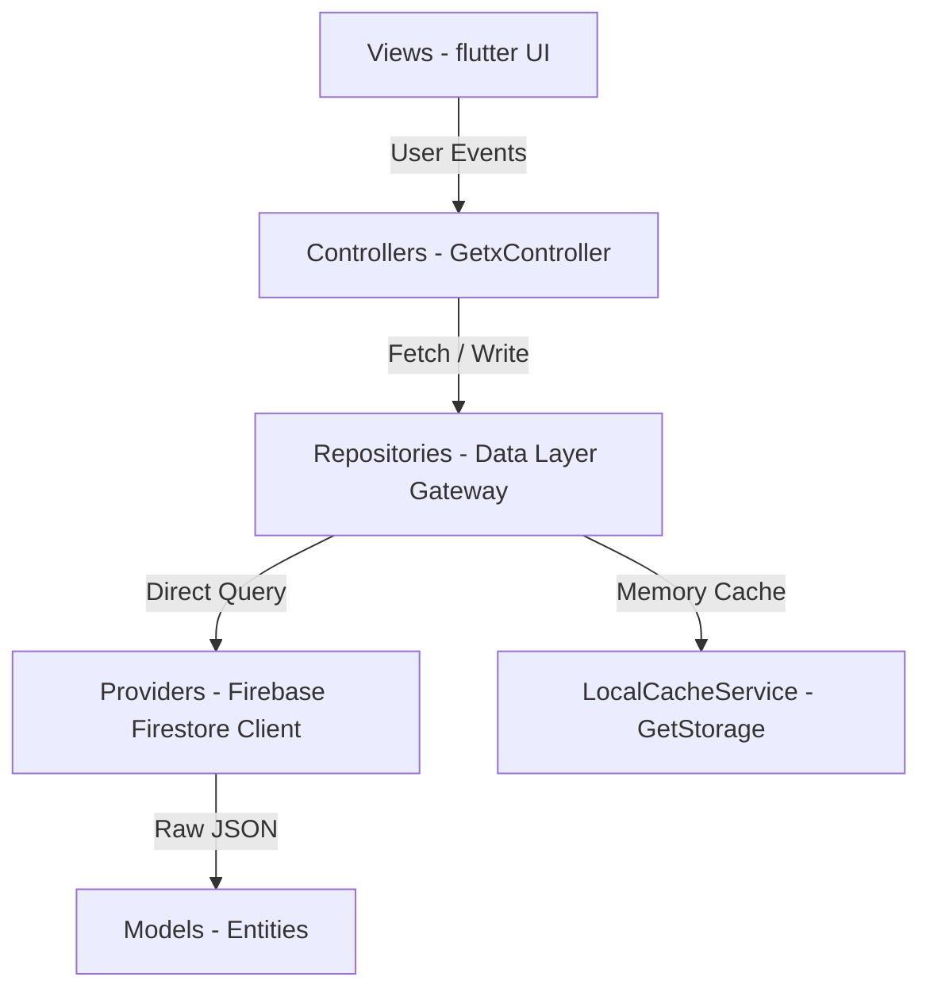
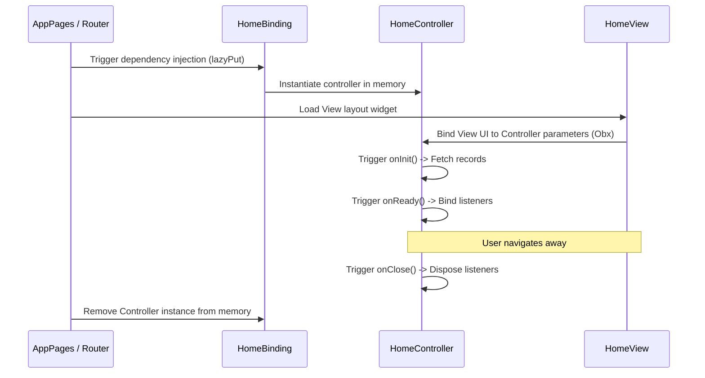

# 💻 DecoTrack: Codebase Technical & Architectural Guide

This guide details the technical architecture, project directory structure, state management patterns, and data flow pipelines of the **decotrack** Flutter application. It serves as a structural map for developers to maintain, refactor, and scale the application.

---

## 🏛️ 1. Architecture & Design Pattern

DecoTrack uses a **Feature-Driven Clean Architecture** combined with **GetX** for dependency injection, reactive state management, and high-performance routing.



### Layer Breakdown

1. **Presentation Layer (UI/Views):**
   * Extends `GetView<T>` (e.g., `GetView<HomeController>`).
   * Clean, stateless widgets built using a dedicated typography and color token system (`AppColor`, `AppTextStyles`).
   * Reacts to state changes using `Obx` observers.
2. **State Management Layer (Controllers):**
   * Extends `GetxController`.
   * Manages local reactive state (`RxInt`, `RxList`, `RxBool`, etc.).
   * Handles user actions, input validations, loading states, and exception catch blocks.
3. **Data Abstraction Layer (Repositories):**
   * Mediates data between controllers and providers.
   * Merges data from multiple providers (e.g., combining cached data with live Firestore fetches).
   * Resolves structural business constraints (e.g., getting all clubs for a specific user ID).
4. **Data Access Layer (Providers):**
   * Direct interface to database engines (currently Firebase Firestore).
   * Maps document databases (`QuerySnapshot` / `DocumentSnapshot`) into clean dart models using `fromJson` serialization.
5. **Domain Layer (Models):**
   * Plain Dart classes modeling entities like `UserModel`, `ClubModel`, `LendingRecordModel`, `ClubNoticeModel`.
   * Holds helper getters (like `signedAmount` on accounting or `isClubMember()`).

---

## 📂 2. Project Directory Structure

```text
lib/
├── firebase_options.dart         # Generated Firebase setup coordinates
├── main.dart                      # App bootstrapper, global service initializations
└── app/
    ├── core/                      # Global core singletons, styling tokens
    │   ├── constants/             # AppColor, AppSize, FirestoreCollection enums
    │   ├── localization/          # Translations, app locales, language service
    │   ├── services/              # Local Cache (GetStorage)
    │   ├── theme/                 # Light/Dark material theme configurations
    │   └── utils/                 # String extensions, converters
    ├── data/                      # Data layer
    │   ├── models/                # Domain models (Club, Lending, Notice, Member)
    │   ├── providers/             # Direct Firestore read/write engines
    │   └── repositories/          # Abstraction gates (ClubRepository, AuthRepository)
    ├── modules/                   # Feature-driven UI Modules (auth, home, notices, lending...)
    │   ├── [feature]/
    │   │   ├── controllers/       # GetX Controllers
    │   │   └── views/             # Screen layouts
    └── routes/                    # High-performance GetX route maps
        └── app_pages.dart         # Path constants, Page bindings, lazy dependency injections
```

---

## 🔁 3. Code Execution & Routing Lifecycle

Here is the exact lifecycle flow of DecoTrack from the moment a user launches the app:

### Stage A: Application Boot (`main.dart`)
1. **Flutter Engine Binding:** Calls `WidgetsFlutterBinding.ensureInitialized()`.
2. **Firebase Engine Init:** Checks `AppConfig.useMockFirebase`. If false, initializes Firebase with your local `google-services.json` credentials.
3. **Global Service Injection:**
   * Injects the **`FcmService`** (Push Notification Engine).
   * Injects the **`AppLanguageService`** (selects/saves user translation preferences in local cache).
4. **Bootstrapping MaterialApp:** Launches `GetMaterialApp` loading configurations for locales, themes, and sets the initial route to `AppRoutes.LOGIN`.

---

### Stage B: Module Transition Lifecycle

When transitioning to a screen (e.g., navigating to `/home`), GetX executes the lifecycle stages as follows:



1. **Route Resolution:** The router looks up `AppRoutes.routes` matching the request `/home`.
2. **Binding Execution:** The router executes the screen's **Binding** class (e.g., `HomeBinding`). This runs `Get.lazyPut(() => HomeController())` to load the controller *only* when it is about to be drawn on screen.
3. **Controller Initialization:**
   * **`onInit()`:** The controller instantiates. It loads initial arguments, fetches initial database collections from the Repository, and toggles active loading spinners.
   * **`onReady()`:** Executed one frame after the widget is drawn. Used for active listeners, animations, or keyboard triggers.
4. **View Binding:** The UI Widget builds, binding its parameters to reactive variables in the controller.
5. **Controller Disposal (`onClose()`):** When the user exits the screen, GetX automatically invokes `onClose()`, freeing up resources, closing open stream subscriptions, and destroying the controller instance from RAM.

---

## ⚡ 4. Reactive Data Flow Pattern

DecoTrack uses GetX's reactive bindings (`RxList`, `RxBool`, `.obs`) to instantly push updates to the UI when data on the backend shifts.

### Example: Loading and Displaying Active Notices

1. **User opens Notice Screen:** `/notice-board` is requested.
2. **`NoticeBoardBinding`** loads `NoticeBoardController` into memory.
3. **`NoticeBoardController.onInit()`** is fired:
   ```dart
   final RxList<ClubNoticeModel> notices = <ClubNoticeModel>[].obs;
   final RxBool isLoading = true.obs;

   @override
   void onInit() {
     super.onInit();
     fetchNotices(); // Queries NoticeRepository
   }
   ```
4. **`NoticeRepository`** queries `NoticeProvider` which queries Firestore:
   ```dart
   // Direct Firestore Collection Fetch
   final snapshot = await _firestore.collection('clubs').doc(clubId).collection('notices').get();
   ```
5. **Provider maps document list** to clean Dart instances:
   ```dart
   final notices = snapshot.docs.map((doc) => ClubNoticeModel.fromJson(doc.data(), doc.id)).toList();
   ```
6. **Controller receives mapped list**, updates the reactive variable `notices.value = notices`, and toggles `isLoading.value = false`.
7. **View reacts instantly:** The UI uses `Obx(() => ...)` to detect that `isLoading` is false and `notices` is populated. It immediately redraws the screen, displaying your notices to the user with a fluid animation.
